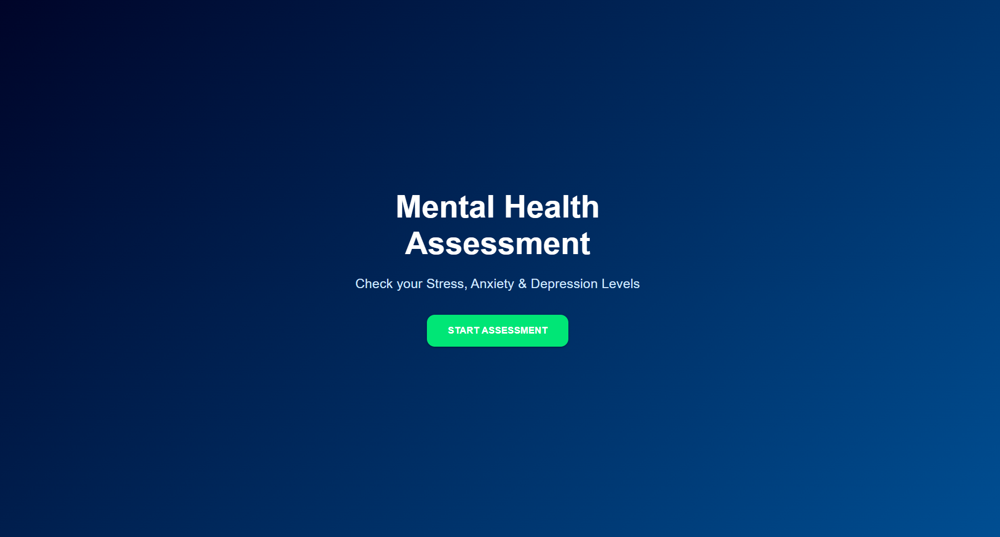
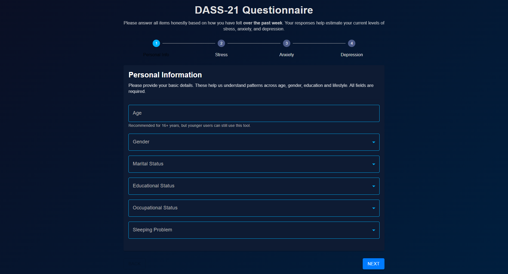
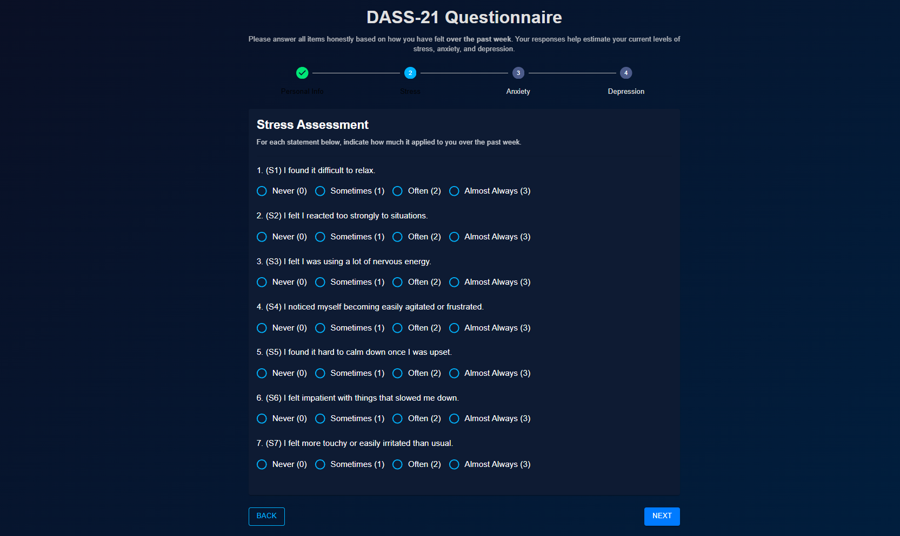
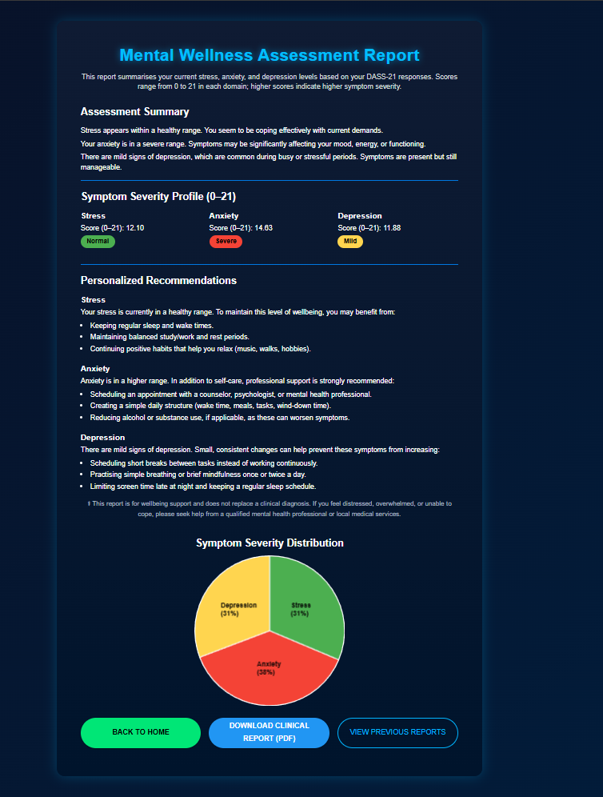

# 🧠 Federated Mental Health Prediction & Personalized Intervention System

### Privacy-Preserving Stress, Anxiety & Depression Analysis using DASS-21


**Author:** K Pragvamsh

---

## 🎯 Demo Flow

1. Fill DASS-21 questionnaire
2. Get predictions (Stress, Anxiety, Depression)
3. View radar chart + severity levels
4. Download personalized PDF report

---

## 🚀 Overview

This project is a **privacy-preserving mental health assessment system** built using **Federated Learning**.

It predicts **Stress, Anxiety, and Depression levels** from user responses while ensuring that:
🔒 **User data never leaves local devices**

The system provides:

* 📊 Mental health scores
* 🧾 Severity classification
* 📈 Visual analytics (radar chart)
* 📄 Personalized PDF report
* 🕒 Assessment history tracking

---

## 💡 Why This Project Matters

Mental health data is highly sensitive. Traditional ML systems require centralizing user data, which raises privacy concerns.

This project solves that by:

* Using **Federated Learning** for decentralized training
* Preserving user privacy
* Enabling scalable healthcare AI systems

---

## 📊 Dataset

📂 Included in repository: `data/DASS.csv`

* Based on **DASS-21 questionnaire**
* 27 input features
* Labels: Stress, Anxiety, Depression


> ⚠️ Dataset is anonymized and used for educational purposes only

---

## ⚡ Quick Start

```bash
git clone https://github.com/your-username/federated_dass21_app.git
cd federated_dass21_app

python -m venv venv
venv\Scripts\activate
pip install -r requirements.txt
# Split dataset for federated clients
python dataset_split.py 
#then proceed to federated training
```

---

## 🧹 Data Preprocessing

```bash
python preprocess_dataset.py
```

✔ Encodes labels
✔ Normalizes features

---

## 🔀 Dataset Splitting

```bash
python dataset_split.py
```

✔ Generates:

* client_1.csv
* client_2.csv
* client_3.csv
* client_4.csv

✔ Simulates federated clients

---

## 🧠 Model

* MLP (Multi-Layer Perceptron)
* Input: 27 features
* Hidden Layer: 64
* Output: 1

✔ Lightweight & efficient
✔ Ideal for tabular healthcare data
[run ./models]
---

## 🧪 Federated Training

### 🔹 Stress Model

```bash
python fl/server_stress.py
python fl/client_stress.py --cid 1
python fl/client_stress.py --cid 2
python fl/client_stress.py --cid 3
python fl/client_stress.py --cid 4
```
💡 Tip: Run the server in one terminal and each client in separate terminals

### 🔹 Anxiety Model

```bash
python fl/server_anxiety.py
python fl/client_anxiety.py --cid 1
```
(similarly for all 4 )

### 🔹 Depression Model

```bash
python fl/server_depression.py
python fl/client_depression.py --cid 1
```
(similarly for all 4)
✔ Models are saved in .pt format inside saved_models/

---


## 📊 Model Performance [run /tests]

* Stress: **87.05%**
* Anxiety: **76.31%**
* Depression: **87.60%**

✔ Evaluated using test split
✔ Confusion matrices generated

---

## 🚀 Run Application

### Backend

```bash
cd backend
uvicorn app:app --reload
```

### Frontend

```bash
cd dass21-frontend
npm install
npm start
```

---

## 📸 Screenshots  

### 🏠 Home Page  


### 📝 DASS Form  



### 📊 Results  



## 📂 Project Structure

```bash
federated_dass21_app/
├── backend/
├── dass21-frontend/
├── fl/
├── models/
├── utils/
├── tests/
├── data/
├── saved_models/
```

---

## 📌 Future Work

* Differential Privacy
* Leave-One-Client-Out evaluation
* Cloud deployment
* Mobile app

---

## 👨‍💻 Author

**K Pragvamsh**
AI | Federated Learning 

---

## ⭐ Support

If you like this project, give it a ⭐ on GitHub!
